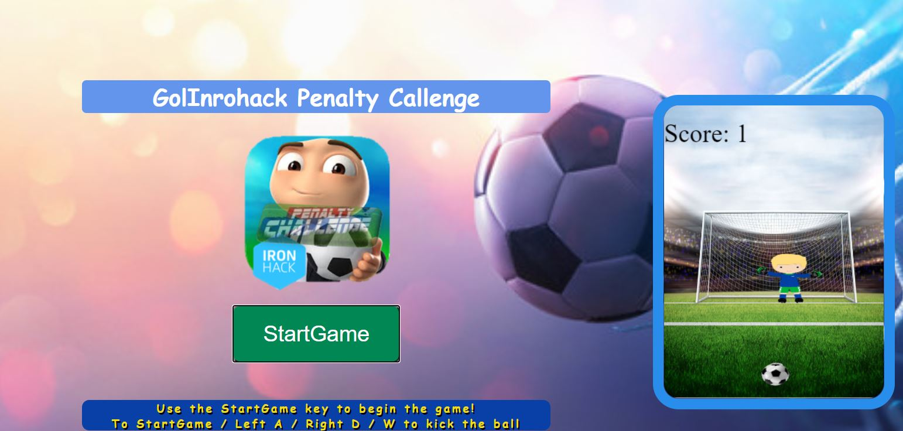

 # GolInrohack Penanty Callenge
(My Ironhack project for fase 1)

Click [HERE](https://emnmoura.github.io/EmnGame/) to start the game.

---    
### Introdution:
The GolIronhack Penalty Challenge is a simple game where the objective is to kick the ball to the goal and to get more goals as possible.

---
### Movement Controls:
- W, A, D
- W => Kick to the goal
- A => Right
- D => Left

---
### Resources:
- The Project uses Canvas technology
- Images from Google Photos
- Flaticon.com/free-icons/gaming
- Sfx free of freesound.org
- Free music at Youtube Music

---
 ### Information:
- All the structure of the game lives at GitHub pages to free access since there is a platform with internet access.
- For who admire and like the game, can give improvements.

